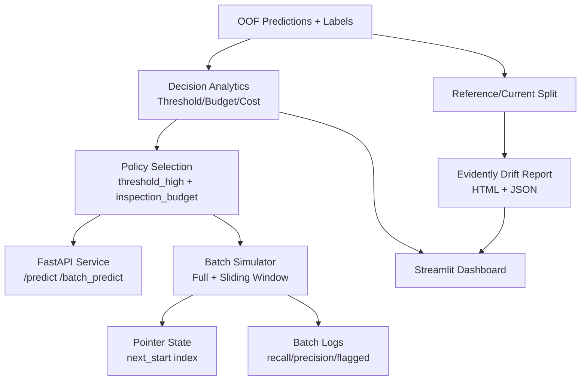

# Production Architecture

## Data Flow
1. Load prediction artifacts and labels from `data/features` and `outputs`.
2. Build decision table across thresholds and inspection budgets.
3. Apply business cost model (`FN=100`, `FP=5`) to rank operating points.
4. Run simulation in either:
   - full replay mode
   - sliding-window mode with persistent pointer and reset-on-end.
5. Generate drift reports with Evidently on stable reference/current split (ID columns excluded).

**Note on the diagram above:** the "Batch Simulator" / "Batch Logs\nrecall/precision/flagged"
path is labeled OOF data (`A["OOF Predictions + Labels"]`) -- this is Track 1 / Offline
Evaluation (`scripts/run_offline_batch_eval.py`), not production inference; see
`docs/ml_system_tracks.md` for the three-track split. A genuinely label-free Track 3
production batch inference path now exists (`scripts/run_production_inference.py`,
dataset_h only): unlabeled rows -> `scripts/build_test_dataset_h.py`'s feature contract ->
model `predict_proba` -> the same `DecisionPolicy`/hybrid policy this diagram's "Policy
Selection" node already represents -> append-only, cycle/batch-partitioned output
(`outputs/production/dataset_h/cycle={n}/batch={n}/predictions.parquet`), with no
recall/precision/flagged-vs-truth anywhere. Not yet drawn as its own diagram node --
that and wiring it into the Streamlit dashboard are follow-up work.

## Runtime Components
- Decision framework: `src/evaluation/decision_system.py`
- Inference decision engine: `src/inference/decision_engine.py`
- Offline batch eval (Track 1, labeled replay): `scripts/run_offline_batch_eval.py`
- Production batch inference (Track 3, label-free): `scripts/run_production_inference.py`
- Monitoring: `src/monitoring/drift_detection.py`
- API: `apps/api/main.py`
- Dashboard: `apps/streamlit_dashboard/app.py`

## Entrypoints
- End-to-end: `python scripts/run_full_system.py`
- Validation: `python scripts/validate_system.py`
- Monitoring report: `python scripts/run_drift_monitoring.py`
- API server: `uvicorn apps.api.main:app --host 0.0.0.0 --port 8000`
- Dashboard: `streamlit run apps/streamlit_dashboard/app.py`

## Deployability
- `Dockerfile.api`
- `Dockerfile.dashboard`
- `docker-compose.yml`
