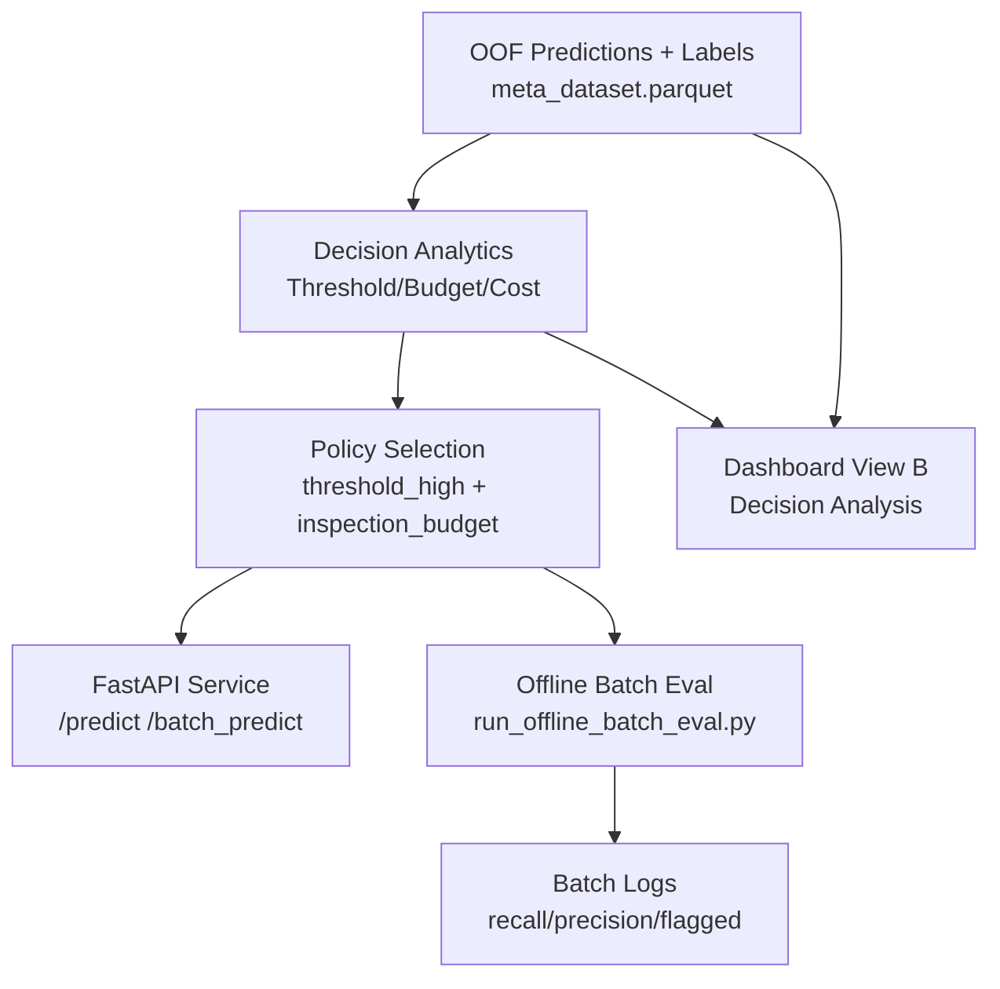
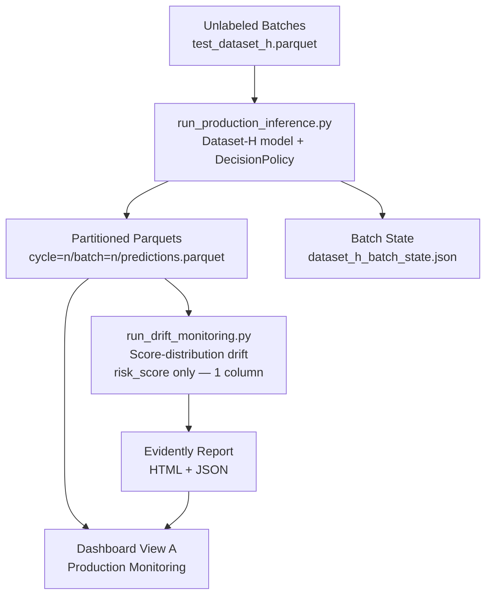

# System Architecture

Two tracks run in parallel on `main`. Track 1 uses labeled OOF data and produces the approved
model and decision policy. Track 3 uses that frozen model to score label-free batches and monitor
score-distribution drift.

## Track 1 — Offline / Decision Layer (labeled OOF)

**Data flow:** OOF predictions with `Response` labels → threshold/budget sweep → business cost
model (`FN=100`, `FP=5`) → approved operating point → policy object (`DecisionPolicy`).

Scripts: `scripts/run_offline_batch_eval.py` (labeled replay), `scripts/build_decision_summary.py`.

## Track 3 — Production Inference (label-free)

**Data flow:** unlabeled rows (`test_dataset_h.parquet`, no `Response`) → dataset_h model
`predict_proba` → `DecisionPolicy` hybrid policy → append-only, cycle/batch-partitioned
output. Drift monitoring reads the prediction parquets (not labeled data): after structural-
column exclusion, Evidently sees exactly one column (`risk_score` → `pred`). Both
`dataset_drift` and `prediction_drift` in the summary are KS tests on this single column
(not independent signals). No recall/precision/MCC anywhere in Track 3 output.

Scripts: `scripts/run_production_inference.py`, `scripts/run_drift_monitoring.py`.
Validation: `scripts/validate_system.py` → `validate_production_inference()`.

## Runtime Components

| Component | Track | File |
|---|---|---|
| Decision analytics | T1 | `src/evaluation/decision_system.py` |
| Decision engine (policy) | T1 + T3 | `src/inference/decision_engine.py` |
| Offline batch eval (labeled replay) | T1 | `scripts/run_offline_batch_eval.py` |
| Production batch inference (label-free) | T3 | `scripts/run_production_inference.py` |
| Score-distribution drift monitoring | T3 | `src/monitoring/drift_detection.py` |
| API | T1 | `apps/api/main.py` |
| Dashboard View B (decision analysis) | T1 | `apps/streamlit_dashboard/app.py` |
| Dashboard View A (production monitoring) | T3 | `apps/streamlit_dashboard/app.py` |

## Entrypoints
- Full system: `python scripts/run_full_system.py`
- Validation: `python scripts/validate_system.py`
- Track 3 drift report: `python scripts/run_drift_monitoring.py`
- API server: `uvicorn apps.api.main:app --host 0.0.0.0 --port 8000`
- Dashboard: `streamlit run apps/streamlit_dashboard/app.py`

## Deployability
- `Dockerfile.api`
- `Dockerfile.dashboard`
- `docker-compose.yml`
